# Rocket.Chat

## Situation initiale

La prod actuelle se trouve sur `escandalo`, une machine mise à disposition par Yulpa, et uniquement accessible en IPv4 (`185.217.152.58`). Cette machine n'est d'ailleurs plus présente dans l'infra maintenue de Yulpa ; pour preuve le reverse DNS utilisé par ces derniers : `58.152.217.185.not.updated.as199712.fr`.

Il n'est pas non plus possible de mettre à jour sa base (son OS), car il s'agit d'un conteneur LXC. Tenter de le mettre à jour casse l'ABI de virtualisation utilisée sur l'hôte et le conteneur ne redémarre plus.

Cette machine dispose de la version de Rocket.Chat 3.0.11 publiée le 2020-04-03 ([src.](https://github.com/RocketChat/Rocket.Chat/releases/tag/3.0.11)). Elle a été installée selon une installation standard, sans Docker, mais via un rôle Ansible. ([src.](https://github.com/LgHS/infra/blob/main/roles/rocketchat/tasks/main.yml))

Cette machine est malheureusement infectée par un crypto miner qui accapare souvent toutes les ressources de la machine si bien qu'il faille la redémarrer régulièrement. Ce crypto miner se serait installé via le fait que la base de données MongoDB ait été rendue accessible publiquement (port 27017). Bien que ce port soit maintenant bloqué, le mal est fait et le crypto miner persistant. Il n'est d'ailleurs pas détectable, car il s'est greffé à pas mal de libs systèmes (dont les `coreutils`).

En outre, il est fort à parier que le serveur soit membre d'un botnet, car, régulièrement, une charge utile s'ouvre sur le port 2000 (en TCP). Il s'agit vraisemblablement du port utilisé par un serveur distant de type « Command and control » ([src.](https://en.wikipedia.org/wiki/Botnet#Command_and_control)). Nous avons détecté ce comportement via l'outil de Monitoring fourni par Shodan. ([src.](https://www.shodan.io/host/185.217.152.58))

En outre, le certificat de cette machine retourne un domaine pour `chat-temp.lghs.be` qui semble indiquer que le chat était précédemment accessible par cette adresse également. Voici le rapport d'état qu'on reçoit par mail pour ce souci (toujours via Shodan.io) :

```
185.217.152.58

// Trigger: ssl_expired
// Port: 443 / tcp
// Hostname(s): 58.152.217.185.not.updated.as199712.fr, chat-temp.lghs.be
// Timestamp: 2022-12-17T00:11:09.909515
// Alert ID: lghs-chat1 (IJCF1NPFL1DV31Q0) 
```

## Plan de migration

Bien que l'objectif final soit de permettre une migration à Mattermost, l'état du serveur actuel est tel qu'une migration directe à Mattermost dans des conditions instables (à cause du crypto miner) n'est pas possible sans prendre le risque d'une corruption de données.

De même, il n'existait pas avant ce projet de migration de script permettant un import de données au sein de Mattermost. Ce dernier, lorsque la fonctionnalité de « compliance report » est active ne permet pas d'insérer des données en conservant la date de publication. (Notons que la fonctionnalité de confirmité - « compliance report » - est activée par défaut et ne peut, à notre connaissance, pas être désactivée facilement sur les versions actuelles de Mattermost). Insérer des données dans le passé est donc impossible. Pour qu'elles soit conservées, il faut que les données historiques soient migrées directement dès le début avant même que de nouvelles données soient insérées. 

La migration vers Mattermost doit donc se faire en 2 étapes :

**Phase 1** : Upgrade à la dernière version de Rocket.Chat ce qui permet :

1. D'avoir un serveur stable qui ne soit plus vulnérable et à partir duquel continuer la migration
2. D'activer la version Entreprise de Rocket.Chat gratuitement pour 30 jours afin de bénéficier de la levée des limites en matière de notifications push. En effet, la version Community de Rocket.Chat est désormais bridée à 1000 notifications push par mois. Il est nécessaire de passer à la version Entreprise pour lever cette limitation. ([src.](https://forums.rocket.chat/t/push-notification-pricing/3006))

**Phase 2** :

1. Migration des données (canaux, chats, threads, fichiers joints et émojis)
2. Installation d'une nouvelle configuration OAuth sur Keycloak
3. Migration des bots vers Mattermost.


## Déploiement d'une nouvelle machine

Bien qu'on dispose d'une machine offerte par Hivane Network ([src.](https://www.hivane.net/)) pour notre nouvelle machine de prod, notre phase 1 va nécessiter une machine temporaire. Pour ce faire, nous allons déployer une machine sur Scaleway.

Nous utilisons le compte personnel de William Gathoye.

Pour que les autres membres du LgHS puissent y accéder, voici les étapes de création que nous avons suivies.

1. Connectez-vous à un compte existant sur `https://console.scaleway.com`.
2. Dans la barre du haut, dans `Organization Dashboard`, cliquez sur le lien `Create Project`.
   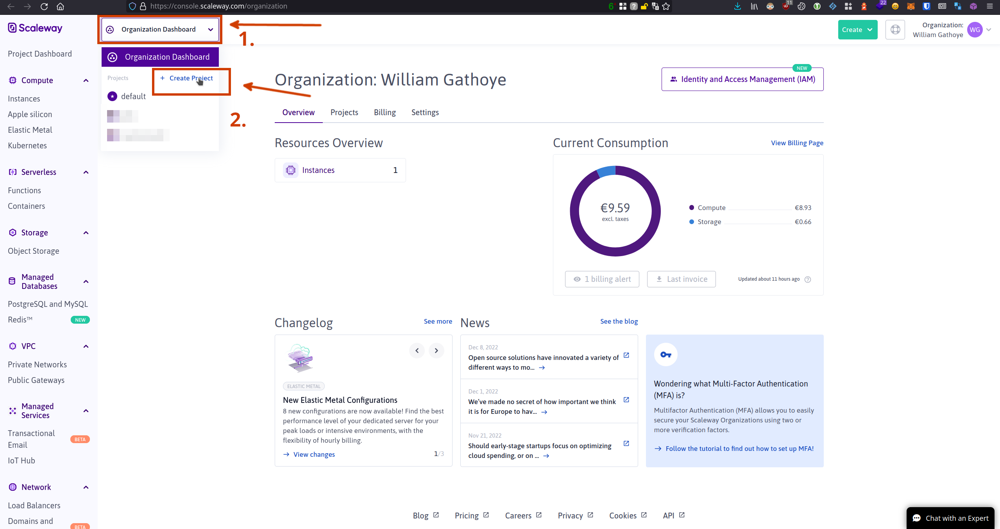
3. Spécifiez le nom du projet (ici `lghs`) et cliquez sur le bouton `Create new project`.
   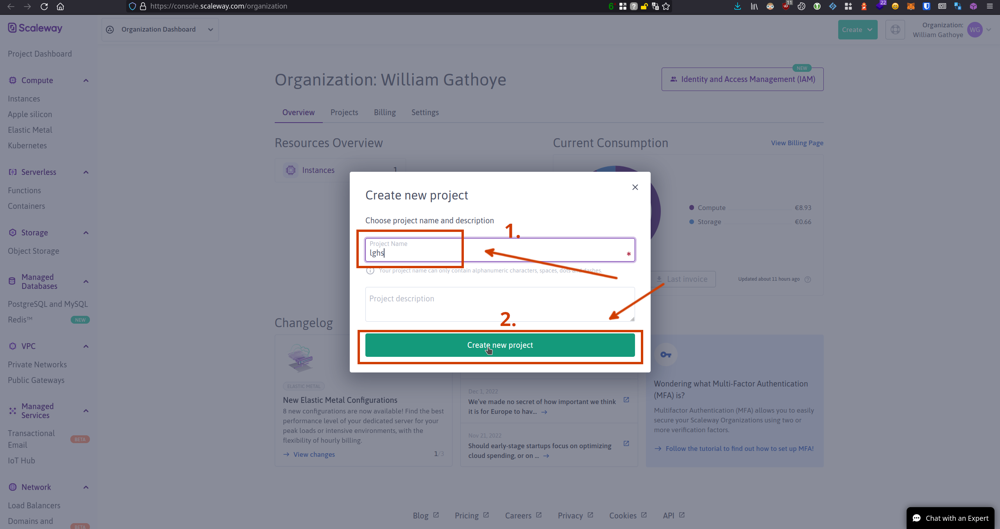
4. Ajoutons maintenant les clés SSH des différents protagonistes du LgHS afin qu'ils puissent accéder à la machine que nous allons créer. Pour ce faire, cliquez sur votre nom d'organisation en haut à droite dans la barre du haut et cliquez sur `SSH Keys`.
   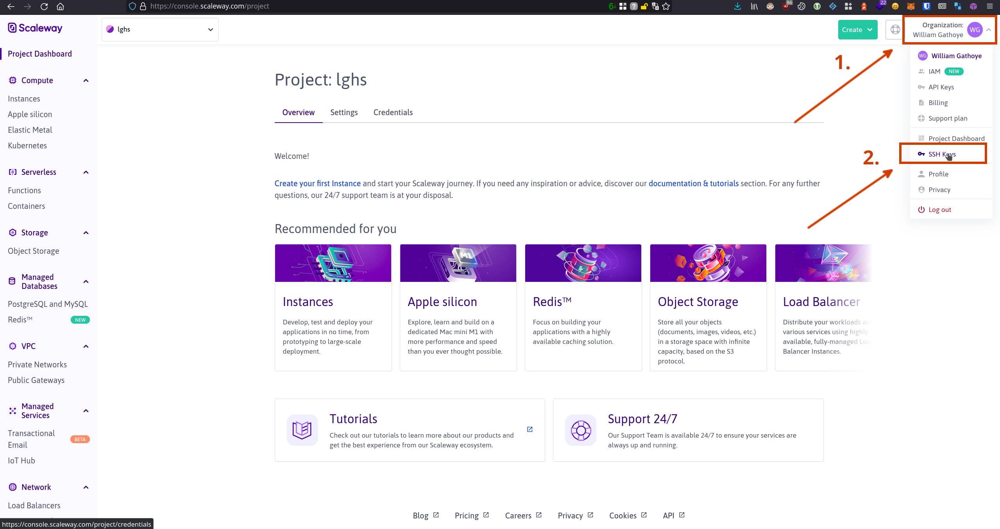
5. Cliquez ensuite sur le bouton `Add a new SSH key`.
   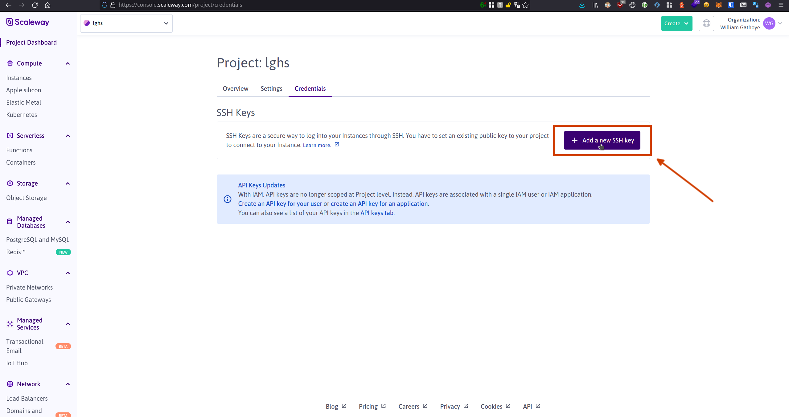
6. Créez ensuite une clé au format ed25519 avec la commande suivante ([src.](https://wiki.archlinux.org/title/SSH_keys#Ed25519)) :
   ```
   ssh-keygen -t ed25519
   ```
7. Dans le premier champ de la boite de dialogue suivante, collez la clé publique (fichier `.pub`) qui vient d'être générée.
8. Dans le second champ, collez un nom de clé pour savoir qui est qui, ici `william_gathoye_ssh_key_2021-10-23_lghs_ed25519` (avoir les prénoms + noms, la date de génération et le type de clé est une bonne idée, car ces informations ne seront plus affichées par la suite au sein de l'interface de Scaleway).
9. Cliquez enfin sur le bouton `Add an SSH key`
   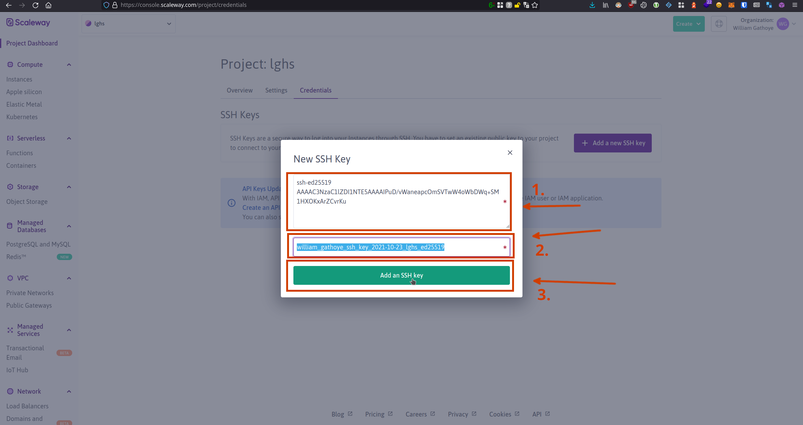
10. Rendez-vous maintenant dans la partie `Instances`.
   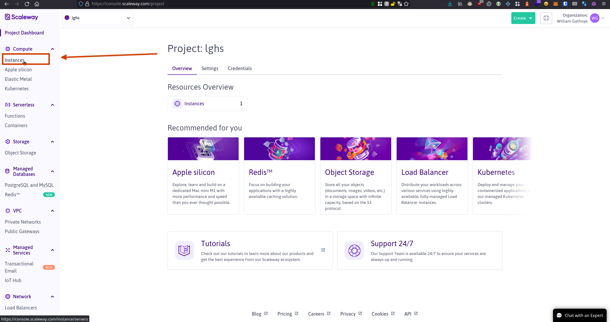
11. Cliquez sur le bouton `Create an instance`.
   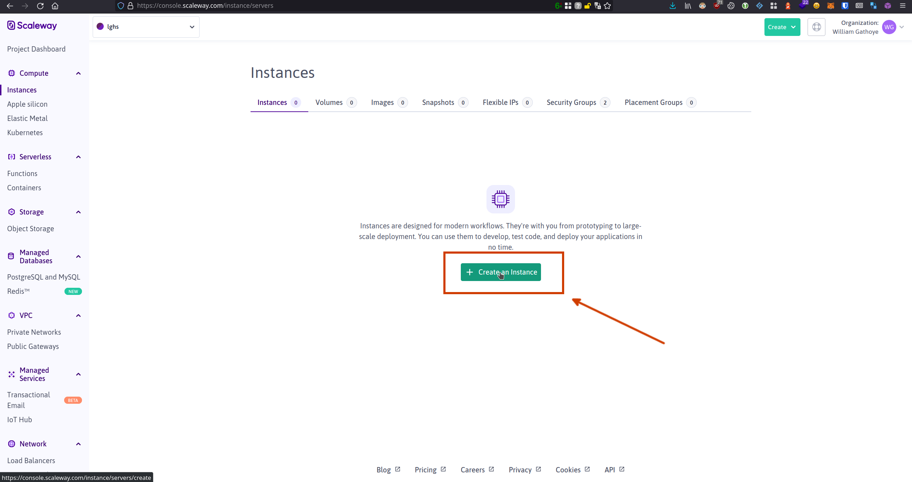
12. Sélectionnez la zone de `Paris 1`
   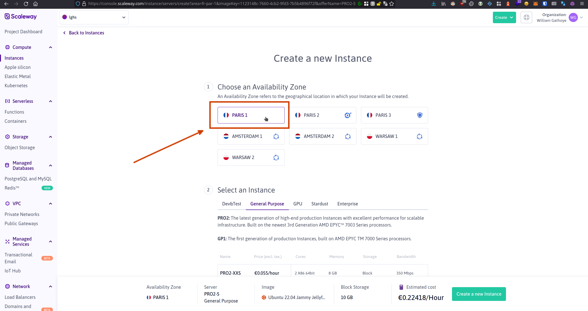
13. Sélectionnez le type de machine `Dev&Test`
   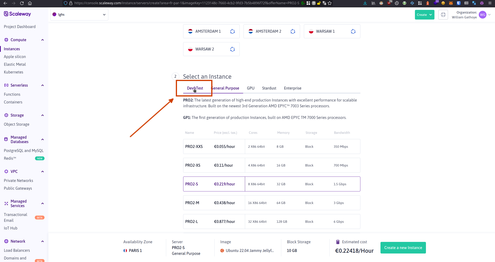
14. Sélectionnez la gamme `DEV1-M`
   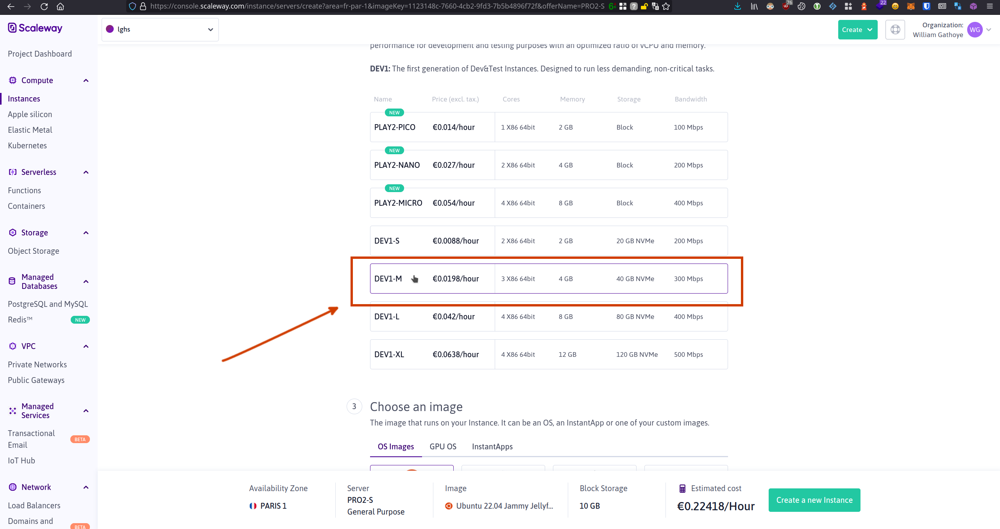
15. Choisissez `Debian Bullseye` (c'est-à-dire Debian 11)
   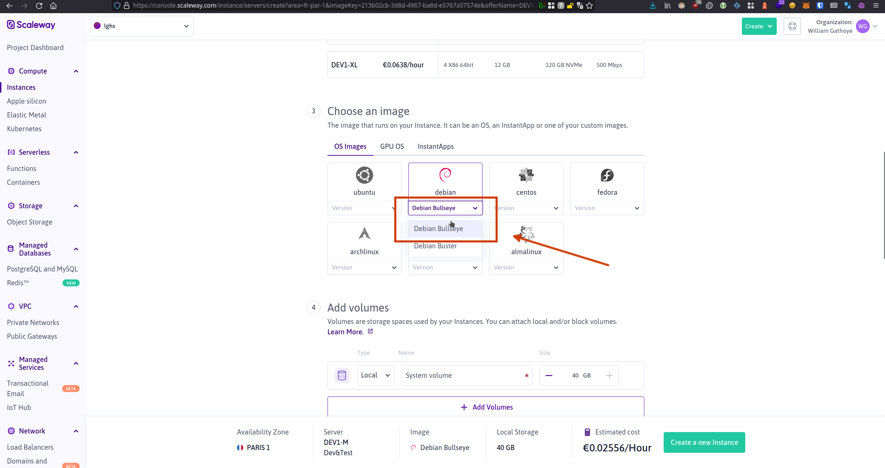
16. Nommez votre volume `lghs-chat`
   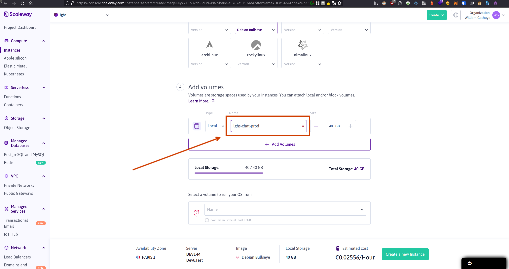
17. Sélectionnez le volume qui vient d'être créé (`lghs-chat`)
   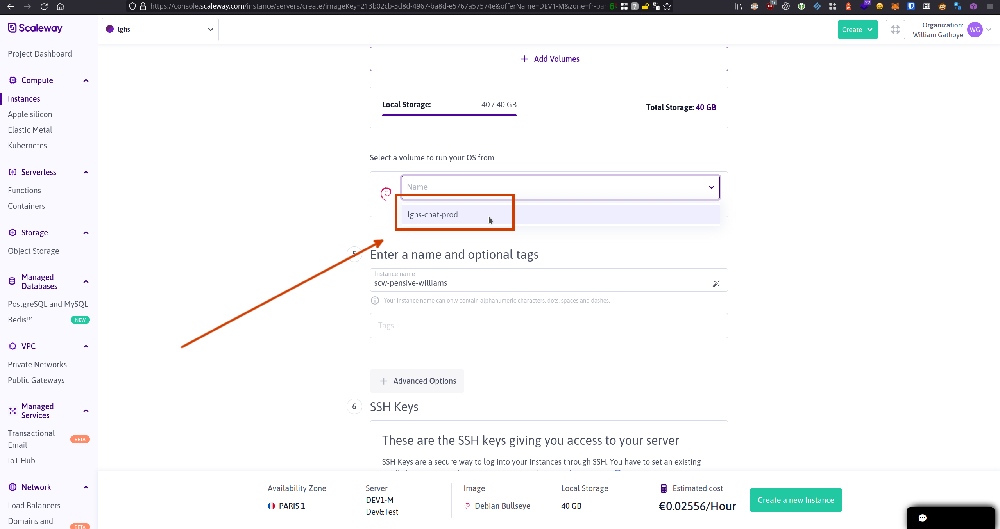
18. Nommez votre machine `lghs-chat`
   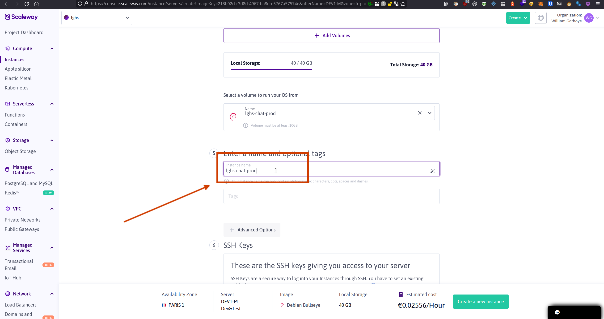
19. Assurez-vous que les clés SSH que vous avez créées précédemment soient bien toutes visibles à cette étape.
   
20. Confirmez la création de l'instance par `Create a new instance`
   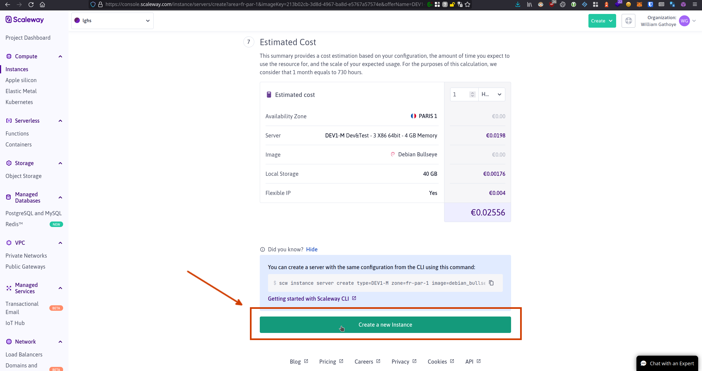
21. Attendez quelques secondes que la machine se crée.
   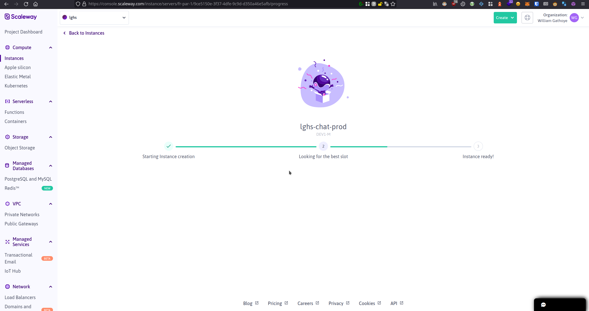
22. Vous allez tomber sur cet écran avec un résumé de la configuration de la machine. Ce qui nous intéresse ici, ce sont les adresses IPv4 et IPv6. Cliquez sur les boutons ad-hoc pour les copier dans votre presse papier.
   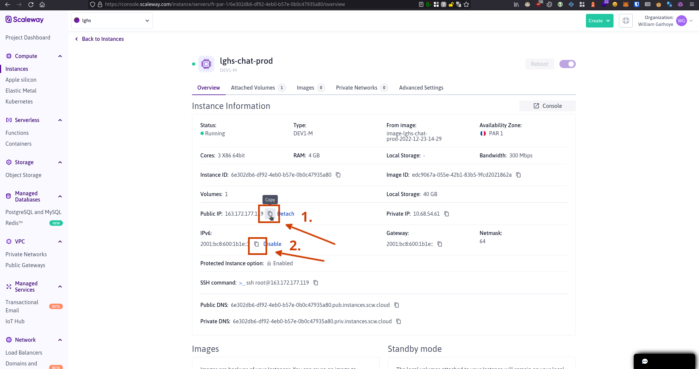
23. Assurez-vous d'avoir vos identifiants à portée de main ou d'avoir une délégation d'accès sur le compte Cloudflare du Liege Hackerspace. Connectez-vous à l'interface de Cloudflare via `https://dash.cloudflare.com` afin de configurer les entrées DNS relatives à cette nouvelle instance.
   
24. Tapez votre code d'identification multifacteur (cette option devrait être activée pour votre compte; dans le cas contraire, ça représenterait un risque de sécurité qu'il serait nécessaire de corriger).
   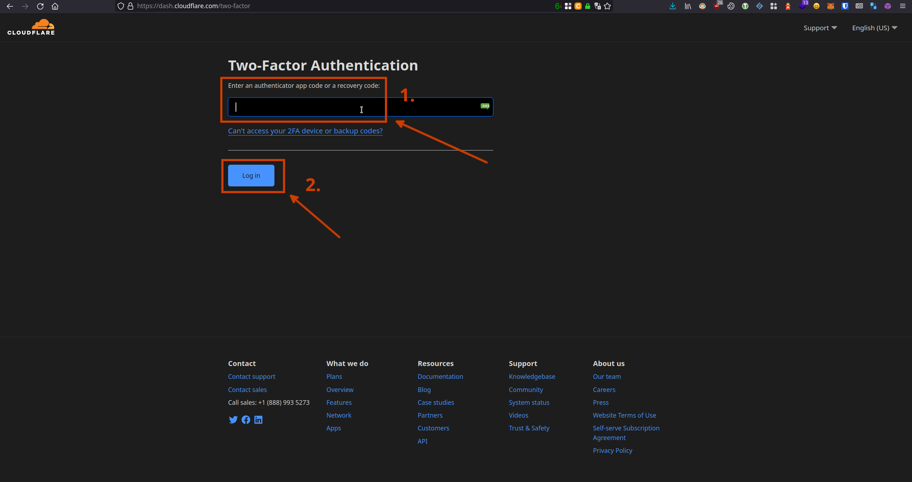
25. Dans le cas où vous administrez plusieurs comptes Cloudflare à l'aide des mêmes identifiants, il se peut qu'il vous soit demandé de choisir le compte approprité. Dans pareil cas, ici choisissez `Liège HackerSpace`.
   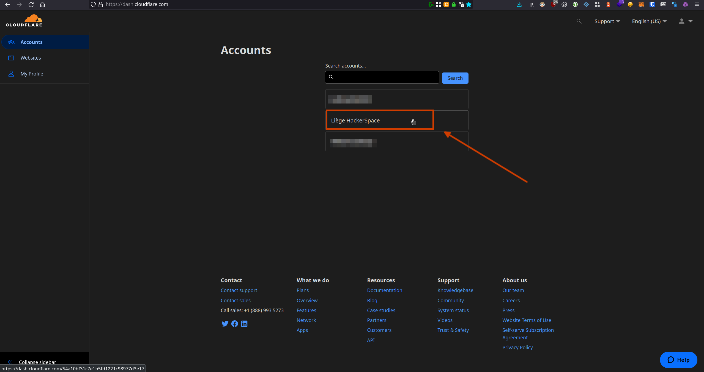
26. Le LgHs dispose de plusieurs noms de domaines. Les sous-domaines placés sur `lghs.be` désignent les URLs que les utilisateurs finaux devront taper pour accéder au service, là où les domaines sur `lghs.space` concernent les domaines techniques. Créons ici un sous-domaine technique. Pour ce faire, choisissez `lghs.space`.
   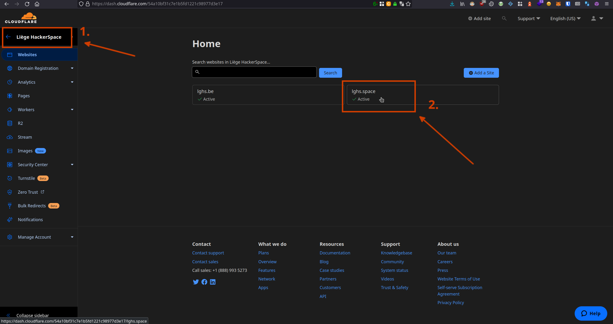
27. Assurez-vous que le bon domaine ait été sélectionné (1); choisissez le menu `DNS` (2); le sous-menu `Records` (3) devrait alors se sélectionner automatiquement; cliquez sur le bouton `Add record` (4), sélectionnez le type `AAAA` (5), spécifiez un sous-domaine (ici `lghs-chat-prod`) (6); spécifiez l'IPv6 que vous avez copiée précédemment à partir du panneau de résumé chez Scaleway (7); désactivez Cloudflare en proxy de l'adresse IP (8); et cliquez sur le bouton `Save`. Réitérez l'opération pour l'adresse IPv4 précédemment copiée (même procédure, changez juste le type en `A`).
   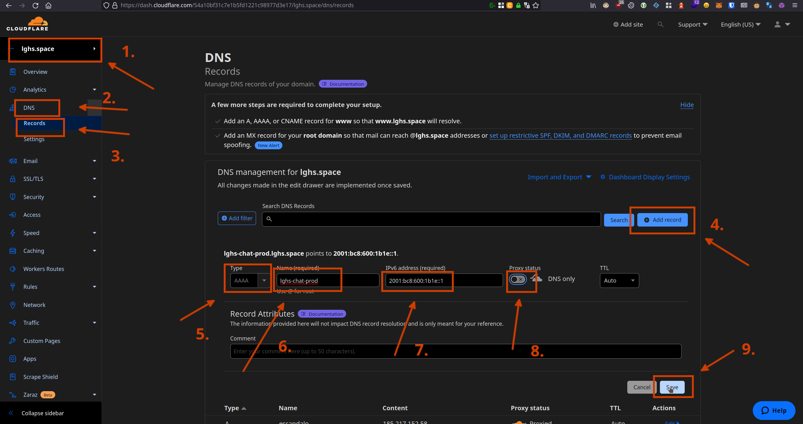

## Connexion à la machine

Créez une entrée dans votre fichier `~/.ssh/config` :
```
Host lghs-chat-prod
    User root
    Hostname lghs-chat-prod.lghs.space
    Port 22
    IdentityFile ~/.ssh/keys/william_gathoye_ssh_key_2021-10-23_lghs_ed25519
```

Attention, notez que si vous décidez de placer par la suite la machine derrière Cloudflare, Cloudflare ne pourra pas par défaut jouer le rôle de proxy SSH, il faudra alors remapper le domaine sur les adresses IP réelles et non celles de Cloudflare. Pour ce faire il faudra placer les adresses IP réelles dans votre fichier `hosts`. C'est la seule méthode valable, OpenSSH est alors assez malin pour choisir la bonne adresse IP selon la stack IP employée (il comprend le fichier `hosts` et ne prendra donc pas le premier venu). ([src.](https://stackoverflow.com/questions/56413458/ssh-config-multiple-hostname-to-the-same-host#comment119695613_56413679))

Voici un exemple avec `vahine` :
```
/etc/hosts
```
```
[...]
2001:bc8:600:1b1e::1 lghs-chat-prod.lghs.space
163.172.177.119 lghs-chat-prod.lghs.space
[...]
```
```
~/.ssh/config
```
```
Host lghs-chat-prod
    User root
    Hostname lghs-chat-prod.lghs.space
    # Add an entry in /etc/hosts in order to force the resolution to the
    # following non Cloudflare proxy addresses
    # 2001:bc8:600:1b1e::1 lghs-chat-prod.lghs.space
    # 163.172.177.119 lghs-chat-prod.lghs.space
    Port 22
    IdentityFile ~/.ssh/keys/william_gathoye_ssh_key_2021-10-23_lghs_ed25519
```

## Préparation de l'environnement

### Sécurisation SSH

Connectez-vous sur `lghs-chat-prod` et assurez-vous que la connexion par mot de passe soit autorisée et que la machine dispose bien d'un mot de passe sur le compte root :
```
/etc/ssh/sshd_config
```
```
+++ sshd_config 2022-12-17 05:31:20.468748364 +0000
@@ -32,6 +32,7 @@

 #LoginGraceTime 2m
 #PermitRootLogin prohibit-password
+PermitRootLogin yes
 #StrictModes yes
 #MaxAuthTries 6
 #MaxSessions 10
@@ -56,6 +57,7 @@

 # To disable tunneled clear text passwords, change to no here!
 #PasswordAuthentication no
+PasswordAuthentication yes
 #PermitEmptyPasswords no

 # Change to yes to enable challenge-response passwords (beware issues with
```
```
# passwd
New password:
Retype new password:
passwd: password updated successfully
# systemctl restart sshd
```

### Installation des dépendances

Connectez-vous à ladite machine et préparons l'environnement Docker.

Commencez par mettre à jour la machine et à installer les outils dont nous aurons besoin :
```
apt update && apt dist-upgrade -y && apt install -y tmux vim rsync
```

Lancez un tmux, très utile pour conserver le shell lors de la migration, et éviter que celle-ci soit perdue en cas de déconnexion.

```
tmux new -s wget
```

Installons le moteur Docker pour Debian 11 ([src.](https://docs.docker.com/engine/install/debian/)) :

```
apt-get remove docker docker-engine docker.io containerd runc
apt-get update
apt-get install -y ca-certificates curl gnupg lsb-release
mkdir -p /etc/apt/keyrings
curl -fsSL https://download.docker.com/linux/debian/gpg | sudo gpg --dearmor -o /etc/apt/keyrings/docker.gpg
echo "deb [arch=$(dpkg --print-architecture) signed-by=/etc/apt/keyrings/docker.gpg] https://download.docker.com/linux/debian $(lsb_release -cs) stable" | sudo tee /etc/apt/sources.list.d/docker.list > /dev/null
apt-get update
apt-get install -y docker-ce docker-ce-cli containerd.io docker-compose-plugin
```

Une fois installé, vérifiez que la version 2 de Compose a bien été installée (en effet nous utilisons cette version plutôt que la version 1 dépréciée) :
```
$ docker compose version
Docker Compose version v2.14.1
```

Installez le frontend NGINX (dépôt Debian) et certbot + méthode DNS-01 via Cloudflare par snap (Snap est la méthode officielle recommandée pour avoir la dernière version) : [src.](https://certbot.eff.org/instructions?ws=nginx&os=debianbuster)
```
apt install -y nginx
apt install -y snapd
snap install core
snap refresh core
snap install --classic certbot
ln -s /snap/bin/certbot /usr/bin/certbot
snap set certbot trust-plugin-with-root=ok
snap install certbot-dns-cloudflare
```

Créez les répertoires dont on a besoin pour le déploiement Docker :
```
mkdir -p /srv/chat.lghs.be/{data,backups}
cd /srv/chat.lghs.be/
```

## Transfert des données

Connectez-bous sur `escandalo`, allez dans le répertoire home de votre utilisateur et exportez la base de données qui, par défaut, donnera un dossier nommé `dump` dans le répertoire de travail actuel :
```
$ cd /home/willget
$ mongodump
2022-12-17T06:22:29.149+0100    writing admin.system.version to dump/admin/system.version.bson
[...]
2022-12-17T06:22:46.957+0100    [####....................]  rocketchat.rocketchat_uploads.chunks  2366/11555  (20.5%)
```

Transférez le dossier sur `lghs-chat-prod` (< 1 min de transfert):
```
rsync -av --info=progress2 dump root@lghs-chat-prod.lghs.space:/srv/chat.lghs.be/backups/dump-2022-12-17
```

## Déploiement d'un Rocket.Chat 3.0.12

Bien que la version actuellement en production soit la 3.0.11, nous allons installer une 3.0.12, car la 3.0.11 ne dispose pas d'une image Docker. ([src.](https://hub.docker.com/layers/library/rocket.chat/3.0.12/images/sha256-6d9a0ede1e2648f0f9f2db52bfe7a3f5888ea2db3d5f94fc48560b1979917d97?context=explore))

Sur `lghs-chat-prod`, allez dans `/srv/chat.lghs.be/` et placez dans ce dossier le fichier Docker Compose (`docker-compose-prod-3.0.12.yml`) suivant (basé sur l'ancien Docker Compose officiel du temps de la 3.0.11 ([src.](https://github.com/RocketChat/Rocket.Chat/blob/5fbbc7d4b907177065497f71122ccb39ec999011/docker-compose.yml))):
```
version: "3.9"

services:
  #  rocketchat:
  #    image: rocketchat/rocket.chat:3.0.12
  #    command: >
  #      bash -c
  #        "for i in `seq 1 30`; do
  #          node main.js &&
  #          s=$$? && break || s=$$?;
  #          echo \"Tried $$i times. Waiting 5 secs...\";
  #          sleep 5;
  #        done; (exit $$s)"
  #    restart: unless-stopped
  #    volumes:
  #      - "/srv/chat.lghs.be/data/www:/app/uploads/"
  #    environment:
  #      - PORT=3000
  #      - ROOT_URL=http://localhost:3000
  #      - MONGO_URL=mongodb://mongo:27017/rocketchat
  #      - MONGO_OPLOG_URL=mongodb://mongo:27017/local
  #    depends_on:
  #      - mongo
  #    ports:
  #      - 3000:3000

  mongo:
    image: mongo:4.2.22
    restart: unless-stopped
    volumes:
     # - ./data/db:/data/db
     - "/srv/chat.lghs.be/data/db:/data/db/"
     - "/srv/chat.lghs.be/backups:/backups/"
    # --smallfiles not supported with mongo 4.2
    # --storageEngine=mmapv1 deprecated in mongo 4.2
    #command: mongod --smallfiles --oplogSize 128 --replSet rs0 --storageEngine=mmapv1
    #command: mongod --oplogSize 128 --replSet rs0 --storageEngine=mmapv1
    command: mongod --oplogSize 128 --replSet rs0

  # this container's job is just run the command to initialize the replica set.
  # it will run the command and remove himself (it will not stay running)
  mongo-init-replica:
    image: mongo:4.2.22
    command: >
      bash -c
        "for i in `seq 1 30`; do
          mongo mongo/rocketchat --eval \"
            rs.initiate({
              _id: 'rs0',
              members: [ { _id: 0, host: 'localhost:27017' } ]})\" &&
          s=$$? && break || s=$$?;
          echo \"Tried $$i times. Waiting 5 secs...\";
          sleep 5;
        done; (exit $$s)"
    depends_on:
      - mongo
```

Le fait que le service Rocket.Chat soit commenté est tout à fait voulu. Ceci est nécessaire, car si le service Rocket.Chat est lancé alors qu'on réimporte les données, trop de mémoire et de puissance seront nécessaires, car Rocket.Chat passera continuellement son temps à réindexer les données menant inexorablement à un OOM.

De même, comme vous le voyez dans cette recette Docker Compose, le dossier `/srv/chat.lghs.be/backups` qui contient nos dumps de MongoDB est monté directement à la racine du conteneur `mongo`, dans le dossier `backups` via un volume Docker.

Lancez l'envionnement Docker en utilisant le fichier Docker précédemment copié.
```
root@lghs-chat-prod:~# cd /srv/chat.lghs.be/
root@lghs-chat-prod:/srv/chat.lghs.be# docker compose -f docker-compose-prod-3.0.12.yml up -d
```

Entrez dans le conteneur relatif à la base mongodb.
```
root@lghs-chat-prod:/srv/chat.lghs.be# docker exec -it chatlghsbe-mongo-1 /bin/bash
root@79f9ab2ea43a:/# cd /backups/
root@79f9ab2ea43a:/# mongorestore --drop dump-2022-12-17/dump
[...]
2022-12-17T06:18:34.572+0000    [##############..........]        rocketchat.rocketchat_uploads.chunks  1.45GB/2.42GB  (60.0%)                                
2022-12-17T06:18:34.572+0000    [######################..]  rocketchat.rocketchat_message_read_receipt  40.0MB/43.4MB  (92.4%)
[...]
2022-12-17T06:19:06.402+0000    finished restoring rocketchat.rocketchat_uploads.chunks (490 documents, 0 failures)
2022-12-17T06:19:06.404+0000    513657 document(s) restored successfully. 0 document(s) failed to restore.
```

L'option `--drop` a été nécessaire car nous rencontrions l'erreur suivante qui pouvait être causée à cause d'index invalides :
```
rocketchat rocketchat_uploads.chunks.bson: connection(localhost:27017[-5]) incomplete read of message header: EOF
```

Cet argument ne fonctionne correctement uniquement si on commente le service Rocket.Chat du fichier Docker Compose pour éviter qu'il ne démarre. Dans le cas contraire, Rocket.Chat essayera de reconstruire les index alors qu'ils sont en cours de suppression, ce qui mènera inexorablement à un crash sans compter les éventuels OOM.

Une fois que tout a été importé, stoppez la stack Docker.
```
root@lghs-chat-prod:/srv/chat.lghs.be# docker compose -f docker-compose-prod-3.0.12.yml down
```

Décommenter les lignes relatives à Rocket.Chat:
```
--- docker-compose-prod-3.0.12.yml      2022-12-30 12:14:23.947310332 +0100
+++ docker-compose-prod-3.0.12-new.yml   2022-12-30 12:51:10.821627262 +0100
@@ -1,28 +1,28 @@
 version: "3.9"

 services:
-  #  rocketchat:
-  #    image: rocketchat/rocket.chat:3.0.12
-  #    command: >
-  #      bash -c
-  #        "for i in `seq 1 30`; do
-  #          node main.js &&
-  #          s=$$? && break || s=$$?;
-  #          echo \"Tried $$i times. Waiting 5 secs...\";
-  #          sleep 5;
-  #        done; (exit $$s)"
-  #    restart: unless-stopped
-  #    volumes:
-  #      - "/srv/chat.lghs.be/data/www:/app/uploads/"
-  #    environment:
-  #      - PORT=3000
-  #      - ROOT_URL=http://localhost:3000
-  #      - MONGO_URL=mongodb://mongo:27017/rocketchat
-  #      - MONGO_OPLOG_URL=mongodb://mongo:27017/local
-  #    depends_on:
-  #      - mongo
-  #    ports:
-  #      - 3000:3000
+  rocketchat:
+    image: rocketchat/rocket.chat:3.0.12
+    command: >
+      bash -c
+        "for i in `seq 1 30`; do
+          node main.js &&
+          s=$$? && break || s=$$?;
+          echo \"Tried $$i times. Waiting 5 secs...\";
+          sleep 5;
+        done; (exit $$s)"
+    restart: unless-stopped
+    volumes:
+      - "/srv/chat.lghs.be/data/www:/app/uploads/"
+    environment:
+      - PORT=3000
+      - ROOT_URL=http://localhost:3000
+      - MONGO_URL=mongodb://mongo:27017/rocketchat
+      - MONGO_OPLOG_URL=mongodb://mongo:27017/local
+    depends_on:
+      - mongo
+    ports:
+      - 3000:3000

   mongo:
     image: mongo:4.2.22
```

Redémarrez la stack Docker :
```
root@lghs-chat-prod:/srv/chat.lghs.be# docker compose -f docker-compose-prod-3.0.12.yml up -d
```

La première fois que Rocket.Chat démarrera (et potentiellement les fois suivantes également), il est susceptible que vous recontriez l'erreur suivante en logs du conteneur Docker de Rocket.Chat. Cette erreur est normale, elle indique juste que Rocket n'a pas pu trouver le serveur Mongo spécifié, il faut juste laisser plus de temps à Mongo pour démarrer (c'est ce qui explique la commande Bash dans la recette Docker Compose qui effectue plusieurs tentatives). ([src.](https://github.com/RocketChat/Rocket.Chat/issues/6963)) :
```
[...]
$MONGO_OPLOG_URL must be set to the 'local' database of a Mongo replica set
[...]
```

Par défaut, le conteneur Docker et sa recette Compose sont configurés pour écouter sur le port 3000 et exporter ce port sur l'hôte. Si vous visitez `https://lghs-chat-prod.lghs.space:3000`, vous devriez tomber sur un Rocket.Chat 3.0.12 fonctionnel. Vous ne pourrez toutefois pas vous y connecter à cause du fait que Keycloack n'est pas configuré pour fonctionner sur l'URI `https://lghs-chat-prod.lghs.space:3000`.

## Configuration d'un reverse-proxy HTTP

Placez la configuration NGINX suivante dans `/etc/nginx/sites-available/rocketchat.conf` ([src.](https://docs.rocket.chat/quick-start/environment-configuration/configuring-ssl-reverse-proxy)) :
```
upstream backend {
    server [::1]:3000;
}

server {
    listen 80;
    listen [::]:80;

    server_name chat.lghs.be;

    return 301 https://$server_name$request_uri;
}

server {
    listen 443 ssl http2;
    listen [::]:443 ssl http2;
    server_name chat.lghs.be;

    # You can increase the limit if your need to.
    client_max_body_size 200M;

    error_log /var/log/nginx/rocketchat.access.log;

    ssl_certificate /etc/letsencrypt/live/chat.lghs.be/fullchain.pem;
    ssl_certificate_key /etc/letsencrypt/live/chat.lghs.be/privkey.pem;

    ssl_protocols TLSv1.2 TLSv1.3;
    ssl_ciphers TLS13-AES-256-GCM-SHA384:TLS13-CHACHA20-POLY1305-SHA256:TLS_AES_256_GCM_SHA384:TLS-AES-256-GCM-SHA384:TLS_CHACHA20_POLY1305_SHA256:TLS-CHACHA20-POLY1305-SHA256:ECDHE-ECDSA-AES256-GCM-SHA384:ECDHE-ECDSA-CHACHA20-POLY1305:ECDHE-ECDSA-AES256-SHA384:ECDHE-RSA-AES256-GCM-SHA384:ECDHE-RSA-CHACHA20-POLY1305:ECDHE-ECDSA-AES256-SHA;
    ssl_prefer_server_ciphers on;

    ssl_ecdh_curve secp521r1:secp384r1;
    ssl_session_cache shared:SSL:50m;
    ssl_session_timeout 1d;
    # HSTS (ngx_http_headers_module is required) (15768000 seconds = 6 months)
    add_header Strict-Transport-Security max-age=15768000;
    # OCSP Stapling ---
    # fetch OCSP records from URL in ssl_certificate and cache them
    ssl_stapling on;
    ssl_stapling_verify on;

    location / {
        proxy_pass http://backend;
        proxy_http_version 1.1;
        proxy_set_header Upgrade $http_upgrade;
        proxy_set_header Connection "upgrade";
        proxy_set_header Host $http_host;

        proxy_set_header X-Real-IP $remote_addr;
        proxy_set_header X-Forwarded-For $proxy_add_x_forwarded_for;
        proxy_set_header X-Forwarded-Proto https;
        proxy_set_header X-Nginx-Proxy true;

        proxy_redirect off;
    }
}
```

Avant de démarrer NGINX, générons un certificat TLS avec LetsEncrypt en utilisant la méthode DNS-01. Cette méthode est bien pratique pour éviter d'utiliser un webroot sans devoir trouer nos règles de firewalling.

Générons ensuite une clé d'API sur Cloudflare spécifique à la zone `lghs.be` pour permettre à Certbot de créer les enregistrements DNS nécessaires. Pour ce faire,

1. Allez sur la page Cloudflare relatives aux jetons (`https://dash.cloudflare.com/profile/api-tokens`) et cliquez sur le bouton `Create Token`.
   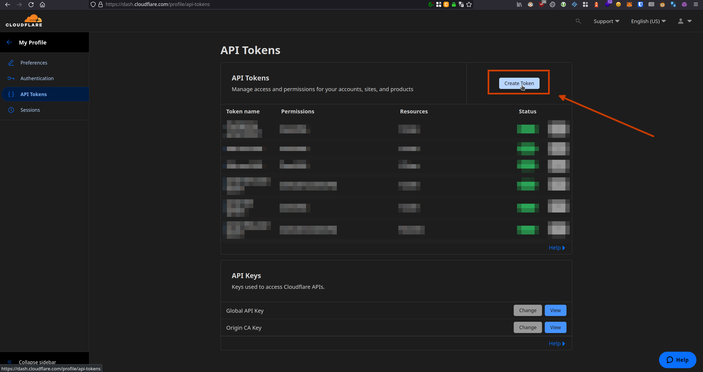
2. On ne veut pas se baser sur un modèle existant, descendez dans le bas de la page et cliquez sur `Get started`
   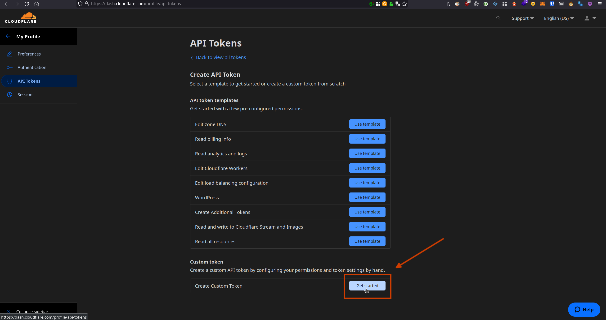
3. Spéfifiez un nom évocateur pour le jeton, ici `chat.lghs.be acme DNS-01` :
   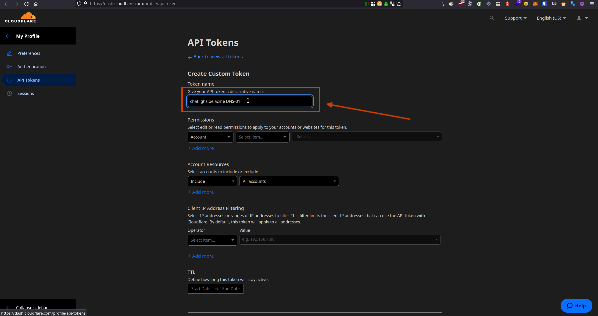
4. Pour ce qui est des permissions, cliquez sur le menu déroulant `Account` et sélectionnez `Zone` :
   
5. Cliquez sur le second menu déroulant `Select an item...` et sélectionnez `DNS` :
   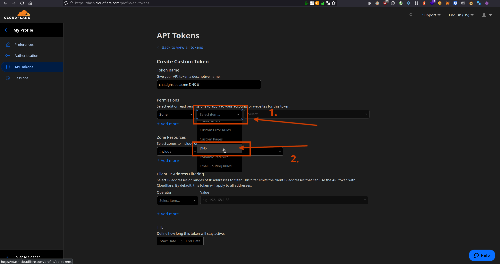
6. Cliquez enfin sur le 3e menu déroulant et sélectionnez `Edit` :
   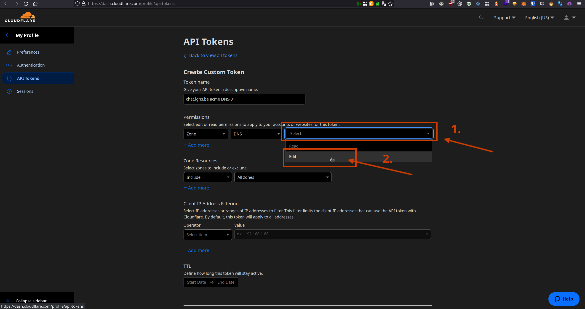
7. Nous allons maintenant restreindre l'accès du jeton à une zone spécifique, cliquez sur le menu déroulant `All zones` et, à la place, sélectionnez `Specific zone` :
   
8. Sélectionnez enfin la zone DNS qui nous intéresse (`lghs.be`) :
   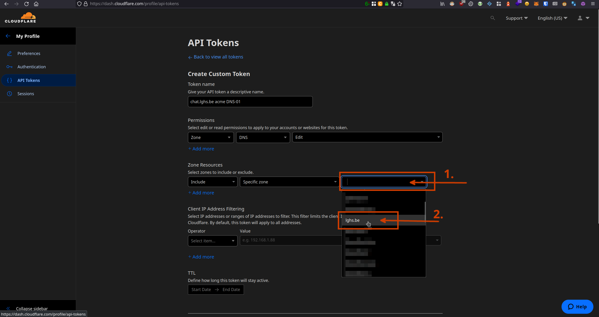
9. Passez la section relative à la date d'expiration (on veut un jeton toujours active) et cliquez sur le bouton `Continue to summary` :
   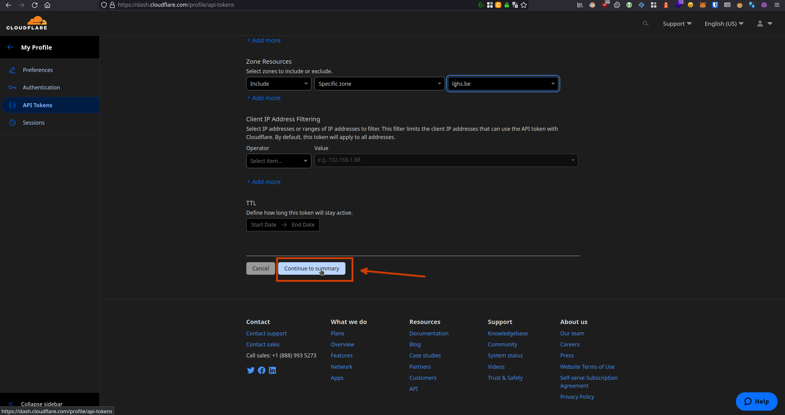
10. Cliquez sur le bouton `Create Token` :
   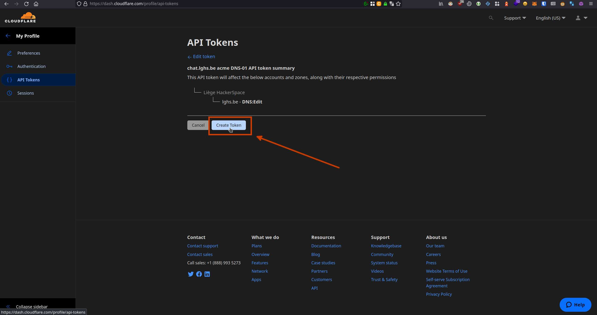
11. Cliquez sur le bouton `Copy` pour copier votre jeton dans le presse papier. Notez que vous avez aussi la possibilité de tester votre jeton avec la commande `curl` spécifiée.
   

Sur `lghs-chat-prod`, créez ensuite le fichier suivant en remplacant la valeur par le jeton que vous venez de copier.

```
/etc/letsencrypt/cloudflare-api-token.ini
```
```
dns_cloudflare_api_token = MON_JETON_CLOUDFLAREs
```

Pour éviter le message d'erreur suivant :
```
[...]
Unsafe permissions on credentials configuration file: /etc/letsencrypt/cloudflare-api-token.ini
[...]
```
changez les permissions d'accès au fichier :
```
chmod 600 /etc/letsencrypt/cloudflare-api-token.ini
```

Générez enfin votre certificat avec la commande suivante ([src.](https://certbot-dns-cloudflare.readthedocs.io/en/stable/)) :
```
certbot certonly --dns-cloudflare --dns-cloudflare-credentials /etc/letsencrypt/cloudflare-api-token.ini -d chat.lghs.be
```

La génération devrait se passer sans trop de souci et le certificat présent à l'emplacement `/etc/letsencrypt/live/chat.lghs.be/fullchain.pem`. Dans le cas contraire, ajoutez l'argument `--staging` pour générer des certificats de test pour déboguer et ainsi éviter le rate limit de LetsEncrypt ([src.](https://letsencrypt.org/docs/rate-limits/)).

Activez ensuite la configuration NGINX :
```
root@lghs-chat-prod:/srv/chat.lghs.be# ln -s /etc/nginx/sites-available/rocketchat.conf /etc/nginx/sites-enabled/rocketchat.conf
```
Testez ensuite la configuration et redémarrez NGINX :
```
root@lghs-chat-prod:/srv/chat.lghs.be# nginx -t
nginx: the configuration file /etc/nginx/nginx.conf syntax is ok
nginx: configuration file /etc/nginx/nginx.conf test is successful
root@lghs-chat-prod:/srv/chat.lghs.be# systemctl restart nginx
```

## Upgrade vers 3.18.2

Contrairement aux autres solutions de chatops disponibles plus robustes (ex.: Mattermost), Rocket.Chat requiert le passage par chaque version mineures (c'est-à-dire X.Y) pour effectuer une mise à jour, sinon on risque des soucis dans les migrations de schémas de bases de données. ne pas avoir de problèmes. Par la notation semver X.Y.Z, la documentation insinue même de passer par chaque version de patch ([src.](https://docs.rocket.chat/quick-start/upgrading-rocket.chat)).

Lors de nos tests, nous avons pu confirmer ce manque de robustesse, car passer directement de la 3.0.12 à la 3.18.2 ne fonctionne pas. Il semblerait que des étapes de migration de schéma de base de données ne soient plus présentes dans les dernnières versions de la branche 3.x. (Par la suite, nous nous sommes rendus compte que passer à la dernière version de la branche 4.x en étant sur la toute dernière version de la branche 3.18 ne fonctionne pas non plus.)

Pour le passage en 3.18, la migration de schéma de base de données ne passe pas correctement en version 231. Il a fallu pour ce faire désactiver temporairement les modules OAuth/SAML. En inspectant le code ([src.](https://github.com/RocketChat/Rocket.Chat/blob/4.5.7/server/startup/migrations/v231.ts#L17-L19)), la migration 231 correspond à une requête mongo relative au plugin OAuth :
```
const query = {
    _id: { $in: [/^Accounts_OAuth_(Custom-)?([^-_]+)$/, 'Accounts_OAuth_GitHub_Enterprise'] },
    value: true,
};
```

L'erreur est connue ([src.](https://github.com/RocketChat/Rocket.Chat/issues/27014)), mais pas corrigée.

Partons du princique que RocketChat 3.0.12 est en cours d'exécution. Stoppons d'abord le conteneur Docker de Rocket.Chat tout en laissant la base de données MongoDB tourner :
```
root@lghs-chat-prod:/srv/chat.lghs.be# docker stop chatlghsbe-rocketchat-1
```

Désactivons temporairement le plugin de Rochet.Chat relatif au processus d'identification OAuth. Pour ce faire, entrez dans le conteneur Docker relatif à MongoDB, lancez le shell de Mongo et vérifions si la valeur qui nous intéresse est bien présente en base de données :
```
root@lghs-chat-prod:/srv/chat.lghs.be# docker exec -it chatlghsbe-mongo-1 /bin/bash
root@e80c9dfa0fb1:/# mongo
rs0:PRIMARY> use rocketchat
rs0:PRIMARY> var col = db.getCollection('rocketchat_settings')
rs0:PRIMARY> col.findOne({_id: { $in: [/^Accounts_OAuth_(Custom-)?([^-_]+)$/, 'Accounts_OAuth_GitHub_Enterprise'] }, value: true})
{
        "_id" : "Accounts_OAuth_Custom-Authlghsbe",
        "_updatedAt" : ISODate("2022-02-15T15:45:36.484Z"),
        "autocomplete" : true,
        "blocked" : false,
        "createdAt" : ISODate("2022-02-15T15:43:57.545Z"),
        "group" : "OAuth",
        "hidden" : false,
        "i18nDescription" : "Accounts_OAuth_Custom-Authlghsbe_Description",
        "i18nLabel" : "Accounts_OAuth_Custom_Enable",
        "packageValue" : false,
        "persistent" : true,
        "secret" : false,
        "section" : "Custom OAuth: Authlghsbe",
        "sorter" : 75,
        "ts" : ISODate("2022-02-15T15:43:57.546Z"),
        "type" : "boolean",
        "value" : true,
        "valueSource" : "packageValue"
}
```

La désactivation du plugin passe par cette commande :
```
rs0:PRIMARY> col.update({"_id" : "Accounts_OAuth_Custom-Authlghsbe"}, {$set: { "value" : false }})
WriteResult({ "nMatched" : 1, "nUpserted" : 0, "nModified" : 1 })
```

Il est ensuite nécessaire de tuer les index de Rocket.Chat, sinon les migration sde schéma échoueront. Pour ce faire, toujours à partir du shell MongoDB :
```
db.rocketchat_nps_vote.dropIndexes()
db.users.dropIndexes()
db.rocketchat_room.dropIndexes()
db.rocketchat_message.dropIndexes()
db.rocketchat_integration_history.dropIndexes()
db.rocketchat_apps_logs.dropIndexes()
```

([src.](https://forums.rocket.chat/t/upgrade-from-snap-3-18-to-4-8/14402/3))

Quittons le shell Mongo et le conteneur mongo et stoppons le reste de l'environnement Docker :
```
root@lghs-chat-prod:/srv/chat.lghs.be# docker compose -f docker-compose-prod-3.0.12.yml down
```

Copions le fichier Docker Compose et changeons la version de Rocket.Chat comme suit :
```
cd /srv/chat.lghs.be
cp docker-compose-prod-3.0.12.yml docker-compose-prod-3.18.2.yml
```

```
--- docker-compose-prod-3.0.12.yml
+++ docker-compose-prod-3.18.2.yml
@@ -2,7 +2,7 @@
 
 services:
   rocketchat:
-    image: rocketchat/rocket.chat:3.0.12
+    image: rocketchat/rocket.chat:3.18.2
     command: >
       bash -c
         "for i in `seq 1 30`; do

```

```
root@lghs-chat-prod:/srv/chat.lghs.be# docker compose -f docker-compose-prod-3.18.2.yml up -d
```

Une fois que `mongo-init-replica` est quitté, 20 secondes après, l'état de démarrage de Rocket.Chat peut être suivi avec la commande suivante. Dès qu'on voit la version de Rocket.Chat et la mention `SERVER RUNNING`, ça veut dire que tout est bon.
```
root@lghs-chat-prod:/srv/chat.lghs.be# docker logs -f chatlghsbe-rocketchat-1
[...]
➔ System ➔ startup                                                                            
➔ +---------------------------------------------+                                    
➔ |                SERVER RUNNING               |                 
➔ +---------------------------------------------+                                                                                                                                           
➔ |                                             |
➔ |  Rocket.Chat Version: 3.18.2                |
➔ |       NodeJS Version: 12.22.1 - x64         |                                             
➔ |      MongoDB Version: 4.2.22                |                  
➔ |       MongoDB Engine: wiredTiger            |                                             
➔ |             Platform: linux                 |
➔ |         Process Port: 3000                  |
➔ |             Site URL: https://chat.lghs.be  |                            
➔ |     ReplicaSet OpLog: Enabled               |                                    
➔ |          Commit Hash: 03394ccaa5            |                                         
➔ |        Commit Branch: HEAD                  |                                                                                                                                           
➔ |                                             |
➔ +---------------------------------------------+
```

Une fois que le serveur a redémarré, on applique la même recette que précédemment. On coupe Rocket uniquement en laissant Mongo tourner et on réactive le plugin OAuth.

```
root@lghs-chat-prod:/srv/chat.lghs.be# docker stop chatlghsbe-rocketchat-1
root@lghs-chat-prod:/srv/chat.lghs.be# docker exec -it chatlghsbe-mongo-1 /bin/bash
root@e80c9dfa0fb1:/# mongo
rs0:PRIMARY> use rocketchat
rs0:PRIMARY> var col = db.getCollection('rocketchat_settings')
rs0:PRIMARY> col.update({"_id" : "Accounts_OAuth_Custom-Authlghsbe"}, {$set: { "value" : true }})
```

On quitte le reste de la stack Docker et on relance le tout :
```
root@lghs-chat-prod:/srv/chat.lghs.be# docker compose -f docker-compose-prod-3.18.2.yml down
root@lghs-chat-prod:/srv/chat.lghs.be# docker compose -f docker-compose-prod-3.18.2.yml up -d
```

## Création d'une sauvegarde

Avant de passer à l'étape suivante, réalisez une sauvegarde de l'instance via la console cloud de Scaleway. En effet, les passages aux versions de Rocket.Chat suivantes, respectivement les branches 4 et 5, ne sont pas des processus tout à fait stables au point de corrompre la base de données. Il nous a fallu d'ailleurs nous y reprendre à plusieurs reprises, d'où l'intérêt de créer une sauvegarde de l'image qui puisse être restaurée en < 5 minutes.

Le jargon utilisé par Scaleway est assez spécifique.

* Une instance c'est simplement une VM, typiquement la machine qu'on a déployée.

* Un volume représente l'espace de stockage d'une instance ([src.](https://www.scaleway.com/en/docs/compute/instances/concepts/#volumes)). Il y a 2 types de volumes :

   * les volumes locaux qui sont hébergés sur le même hyperviseur local où tourne l'instance, ils sont de taille fixe et cette dernière dépent du type d'instance choisi.

   * les volumes de type bloc qui sont des espaces réseaux virtuels qui peuvent être attachés/détachés d'une instance. Les volumes de type bloc sont généralement utilisés pour augmenter la taille d'une instance.

* Un snapshot est la fonctionnalité qui permet de créer une image d'un volume spécifique d'une instance. Comme les snapshots sont des copies de disque et dès lors occupent la même place que ces derniers, ils sont facturés au tarif en vigueur. ([src.](https://www.scaleway.com/en/docs/compute/instances/how-to/create-a-snapshot/))

  Il existe 3 types de snapshots :

  * Les LSSD (Local storage) qui sont créés à partir de volumes locaux. Ils peuvent être uniquement convertis en volumes locaux.
  * Les BSSD (Block storage) qui sont créés à partir de volumes de type bloc. Ils peuvent être uniquement convertis en volumes de type bloc.
  * Les Unified qui sont créés à partir de volumes locaux ou de type bloc. Ils peuvent être convertis au choix, en volumes locaux ou en volumes de type bloc.

* Une image est la fonctionnalité qui permet de créer une image complète de l'instance, en ce y compris des volumes. La fonctionnalité d'image fait donc appel aux snapshots de façon sous-jacente. Les images sont gratuites, mais créer une image crée automatiquement des snapshots de disques, qui eux restent bel et bien payants.

Ici, comme notre instance ne dispose que d'un volume, vous allons simplement créer une image, sauvegarder tout est suffisant.

1. Assurez-vous d'être dans le bon projet (`lghs`), sélectionnez `Instances` et puis la machine à sauvegarder.

   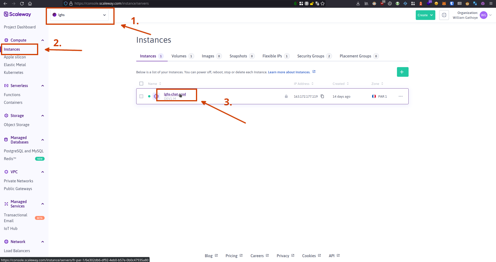

2. Allez ensuite dans l'onglet `Images` :

   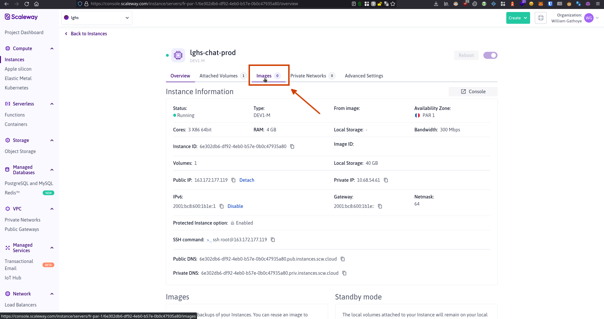

3. Cliquez ensuite sur le bouton `Create an image` :

   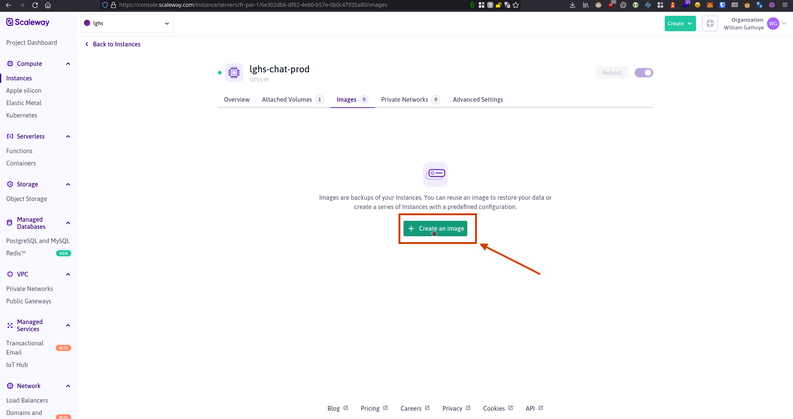

   Notez que s'il existe déjà une image pour votre instance, le bouton est situé plus en haut, à droite de la liste :

   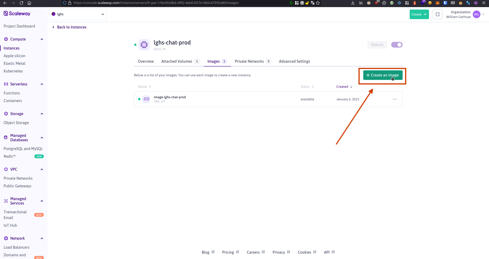

4. Sélectionnez le type d'image standard (les volumes `unified` décrit plus haut sont en effet beaucoup plus chers) et cliquez sur le bouton `Create an image from the instance` :

   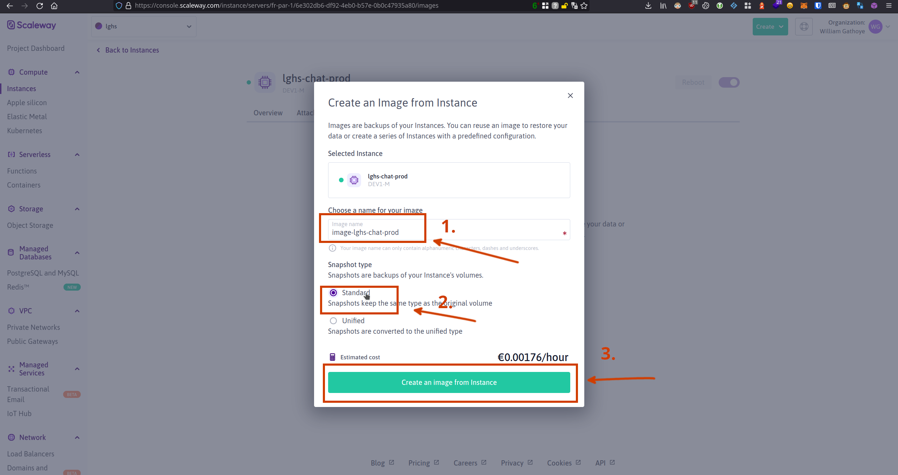

5. Attendez que le point bleuclignant passe au vert fixe pour pouvoir continuer :

   

6. Cliquez ensuite sur les 3 petits points en regard de l'image qui vient d'être créée et sélectionnez l'élément du menu `Create an instance from image` :

   

7. Cette action va vous rediriger vers la page de création d'instance que nous connaissons des étapes précédentes. Sélectionnez la région que vous souhaitez et le type de machines `Dev&Test` :

   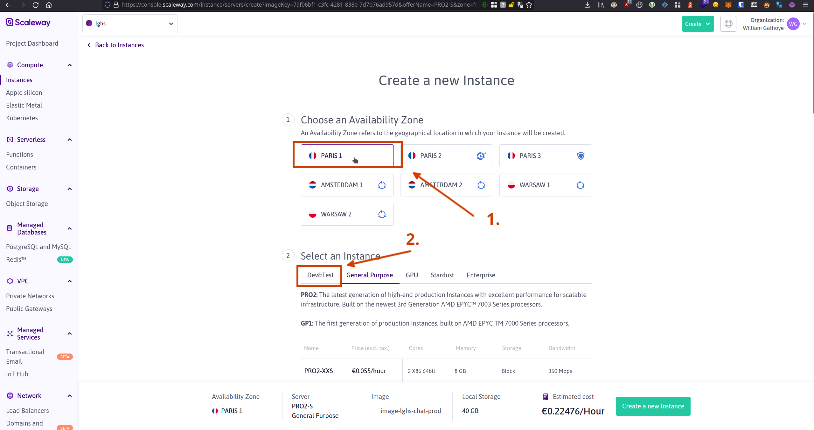

8. Sélectionnez alors le même type de machine `DEV1-M` que précédemment. Remarquez que si vous vouliez sélectionner une machine de taille trop petite, vous en êtes déjà averti à ce stade par la mention `The selected image (image-lghs-chat-prod) cannot be run on this Instance.`

   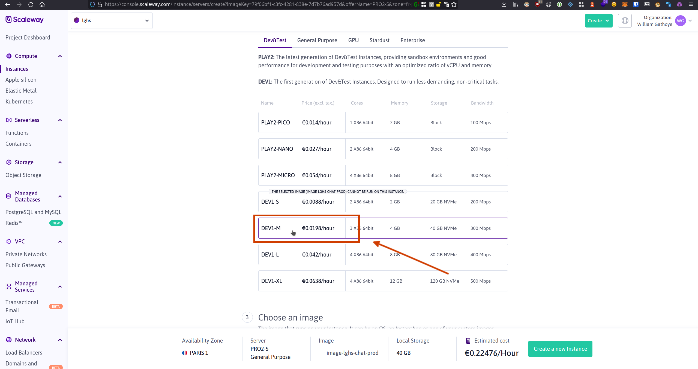

9. Assurez-vous que l'image que vous venez de créer est toujours bien sélectionnée (`My Images` puis le nom de l'image précédemment créée). Il se peut en effet que àça ne soit plus le cas si vous avez sélectionné une machine plus petite malgré l'avertissement affiché.

   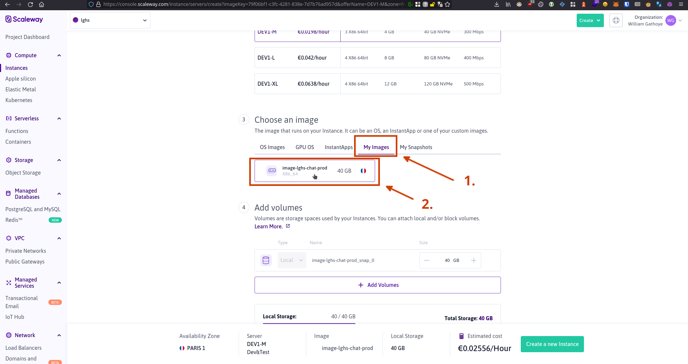

10. Remarquez qu'à cette étape, il ne vous est pas possible de changer le nom du volume vu que celui-ci a été défini lors de la création du snapshot lui-même créé par l'image d'instance.

    

11. Choisissez un nom d'instance, ici `lghs-chat-test` :

    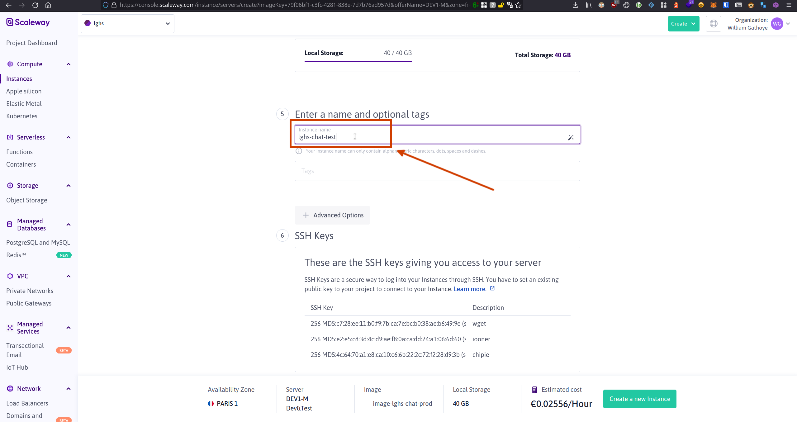

12. Assurez-vous que les bonnes clés SSH soient attribuées et les empreintes visibles à cette étape :

    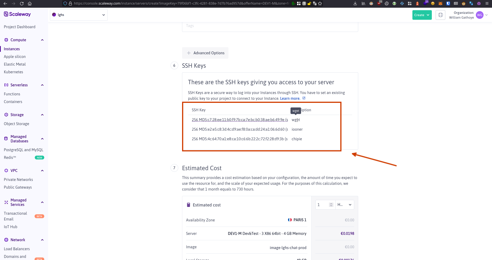

13. Prenez note du récapitulatif tarifaire et cliquez sur le bouton `Create a new instance` :

    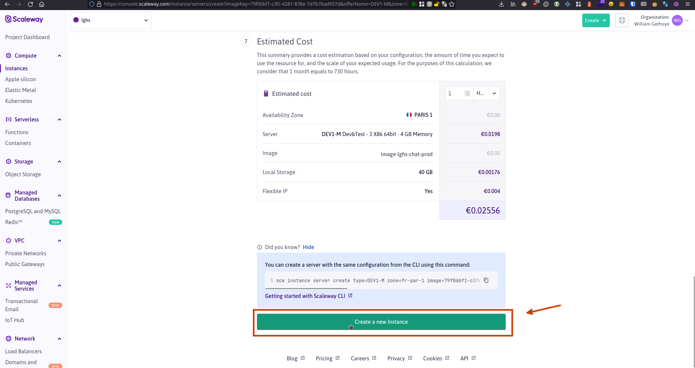

14. Attendez que l'instance se crèe :

    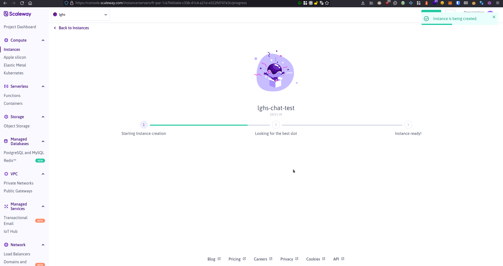

15. Vous disposez dès à présent d'une machine clone de la production. Suivez ensuite les étapes comme décrit dans la procédure du chapitre précédent `Déploiement d'une nouvelle machine`, à partir de l'étape 22 pour savoir comment attribuer un sous-domaine `lghs-chat-test.lghs.space`.


## Réactivation des notifications push

cf. screenshots


API d'enregistrement manuel (`api/v1/cloud.manualRegister`) semble être non dispo en 3.18.2, car l'appel du noeud retourne une 404. ([src.](https://developer.rocket.chat/reference/api/rest-api/endpoints/core-endpoints/cloud-endpoints/cloud-manual-register))


Nouvelle passerelle enregistrée correctment et nouvelles CGU activées, mais dans les logs, on voit que le serveur a été précédemment enregistré sur le site cloud. Il faut retrouver l'accès à ce compte. De même lorsqu'on tente de se déconnecter, et qu'on reclique pour établir une nouvelle collection, Rocket réutilise les anciens identifiants sans nous laisser la possibilité d'en saisir des nouveaux (ou de nous indiquer quel était l'ancien qui a été employé). ([src.](https://docs.rocket.chat/guides/administration/admin-panel/settings/push-notifications-admin-guide))

En cliquant sur le bouton de test pour générer une notification sur les périphériques mobiles, on obtenait un message d'erreur indiquant qu'il n'y avait pas de jeton pour l'utilisateur en cours. Pour pallier ce problème, nous avons juste dû ous déconnecter de l'app mobile et nous reconnecter. Appuyer sur le bouton de test a alors fonctionné avec un toast indiquant que l'action s'était bien passée, mais nous ne recevions quand même pas la notification sur le mobile. 

En regardant dans les logs, on a vu la raison :

```
root@lghs-chat-prod:/srv/chat.lghs.be# docker logs -f chatlghsbe-rocketchat-1
[...]
Push ➔ info gateway rejected push notification. not retrying. {                                                                                                                             
  statusCode: 422,                                                                                                                                                                          
  content: '{"code":131,"error":"the amount of push notifications allowed for the workspace was used","requestId":"290ba554-7c27-4286-8559-633b2a29fd90","status":422}',                    
  headers: {                                                                                                                                                                                
    'access-control-allow-headers': 'Content-Type, Authorization, Content-Length, X-Requested-With',                                                                                        
    'access-control-allow-methods': 'GET, PUT, POST, DELETE, OPTIONS',                                                                                                                      
    'access-control-allow-origin': '*',                                                                                                                                                     
    'access-control-expose-headers': 'Content-Type, Authorization, Cache-Control, Expires, Pragma, X-powered-by',                                                                           
    'cache-control': 'private, no-cache, no-store, must-revalidate',                                                                                                                        
    'content-length': '154',                                                                                                                                                                
    'content-type': 'application/json; charset=utf-8',                                                                                                                                      
    date: 'Fri, 23 Dec 2022 05:26:47 GMT',                                                                                                                                                  
    expires: '-1',                                                                                                                                                                          
    pragma: 'no-cache',                                                                                                                                                                     
    vary: 'Accept-Encoding',                                                                                                                                                                
    'x-powered-by': 'Rocket Fuel and Rocketeers',                                                                                                                                           
    connection: 'close'                                                                                                                                                                     
  },                                                                                                                                                                                        
  data: {                                                                                                                                                                                   
    code: 131,                                                                                                                                                                              
    error: 'the amount of push notifications allowed for the workspace was used',                                                                                                           
    requestId: '290ba554-7c27-4286-8559-633b2a29fd90',                                                                                                                                      
    status: 422                                                                                                                                                                             
  }                                                                                                                                                                                         
}
```

Une des solutions serait d'aller supprimer l'enregistrement en base de données selon les collections dont les noms commenceraient par `Cloud_*`. ([src.](https://forums.rocket.chat/t/cloud-registration-token-problem/14995/2))

Cependant, nous n'avons rien trouvé de tel en tentant de les lister.
```
rs0:PRIMARY> db.getCollectionNames()
```
([src.](https://www.mongodb.com/docs/manual/reference/command/listCollections/))


```
db.rocketchat_settings.update({_id:/Cloud_.*/}, {$set:{value:""}},{multi:true})
```


## Upgrade vers 4.8.6

Pour le passage de la 3.18.2 à 4.8.6, exécuter les commandes précédentes jusqu'il n'y ait plus de souci de migration de schéma de base de données.

## Upgrade vers 5.4.1

On a obtenu la stack trace suivante :
```
[...]
ervers: Map(1) {                                                                                                                                                              [41/1821]
      'localhost:27017' => ServerDescription {
        _hostAddress: HostAddress { isIPv6: false, host: 'localhost', port: 27017 },                                                                                                        
        address: 'localhost:27017',
        type: 'Unknown',                                                                                                                                                                    
        hosts: [],                                                                                                                                                                          
        passives: [],                                                                                                                                                                       
        arbiters: [],                                                                                                                                                                       
        tags: {},                                                                                                                                                                           
        minWireVersion: 0,               
        maxWireVersion: 0,                                                                                                                                                                  
        roundTripTime: -1,
        lastUpdateTime: 34892529,                                                                                                                                                           
        lastWriteDate: 0,                                                                                                                                                                   
        error: MongoNetworkError: connect ECONNREFUSED 127.0.0.1:27017                                                                                                                      
            at connectionFailureError (/app/bundle/programs/server/npm/node_modules/meteor/npm-mongo/node_modules/mongodb/lib/cmap/connect.js:381:20)                                      
            at Socket.<anonymous> (/app/bundle/programs/server/npm/node_modules/meteor/npm-mongo/node_modules/mongodb/lib/cmap/connect.js:301:22)
            at Object.onceWrapper (events.js:520:26)                                                                                                                                        
            at Socket.emit (events.js:400:28)                                                                                                                                               
            at emitErrorNT (internal/streams/destroy.js:106:8)                                                                                                                              
            at emitErrorCloseNT (internal/streams/destroy.js:74:3)                                                                                                                          
            at processTicksAndRejections (internal/process/task_queues.js:82:21)
      }                                                                                                                                                                                     
    },                      
[...]
```

```
config = rs.config()
config.members[0].host = 'chatlghsbe-mongo-1:27017'
rs.reconfig(config)
```

([src.](https://github.com/RocketChat/Rocket.Chat/issues/26519#issuecomment-1218480192))


La précédente version de la branche 4.x (la 4.8.6) indique que MongoDB version 4.2 est pris en charge. ([src.](https://github.com/RocketChat/Rocket.Chat/releases/tag/4.8.6)) Nous n'avons donc pas à mettre à jour la version de Mongo à présent.


Crash lors de l'upgrade direct de la v. 3.0.12 à 4.8.6.

Tentative de migratiob sur 4.0.0

([src.](https://github.com/RocketChat/Rocket.Chat/releases/tag/4.0.0))

```
cp docker-compose-prod-3.0.12.yml docker-compose-prod-4.0.0.yml
```

Your database migration failed:                                     |                                                                                                                    
|  Start date cannot be later than expire date


même erreur en 4.0

https://github.com/RocketChat/Rocket.Chat/releases/tag/4.8.7


Il a ensuite fallu délocker les migrations pour qu'elles puissent s'exécuter à nouveau :
```
rs0:PRIMARY> use rocketchat
rs0:PRIMARY> db.migrations.update({"_id": "control"}, {$set:{locked: false}})
```


([src.](https://github.com/RocketChat/Rocket.Chat/issues/15372))


```
{"line":"120","file":"migrations.js","message":"Migrations: Migrating from version 230 -> 232","time":{"$date":1671721103672},"level":"info"}
{"line":"120","file":"migrations.js","message":"Migrations: Running up() on version 231","time":{"$date":1671721103675},"level":"info"}
{"line":"120","file":"migrations.js","message":"Migrations: Running up() on version 232","time":{"$date":1671721103685},"level":"info"}
{"line":"120","file":"migrations.js","message":"Migrations: Finished migrating.","time":{"$date":1671721103742},"level":"info"}
```


## Versions prises en charge

https://docs.rocket.chat/getting-support/enterprise-support


Old workspace:
https://cloud.rocket.chat/workspaces/63a56340b3c77e000185eaa2


## Firewalling

### Au niveau de la machine

### Au niveau de Scaleway

Le souci des dernières versions de Docker est qu'il modifie selon son bon vouloir un firewall qu'on aurait installé comme `firewalld`. Même si on ne l'utilise pas, Docker créera des CHAIN spéciales avec iptables/nftables, qui, en fonction des politiques de routing de la machine, pourrait entrainer certains ports internes des conteneurs à être exposés.

De façon a éviter ce cas de figure et de façon à éviter de reproduire la situation de compromission avec l'ancienne machine, il est fortement recommandé d'appliquer des règles de firewalling sur la machine au niveau réseau chez Scaleway.

1. Retournez sur les instances via le lien `Instances` de la barre latérale de gauche, sélectionnez `Security Groups` et cliquez sur le bouton `Create a security group`.
   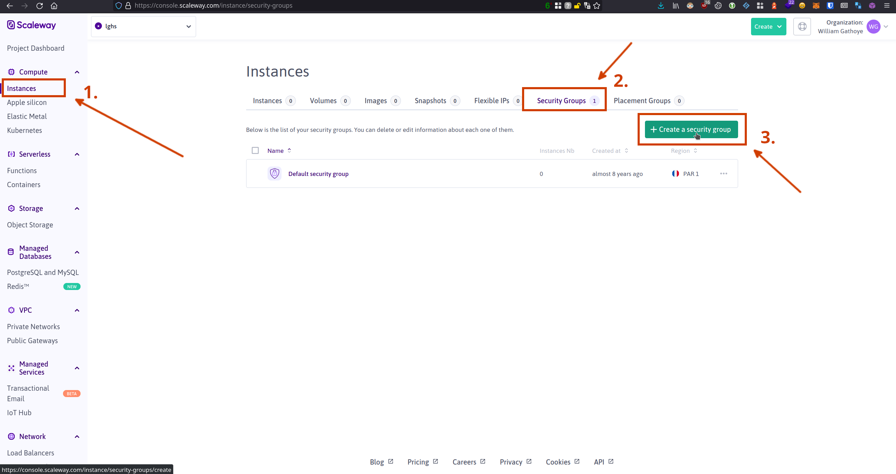
2. Attribuez un nom à votre groupe de sécurité. Ici, nous avons choisi de le nommer arbitrairement `hardened-conf`.
   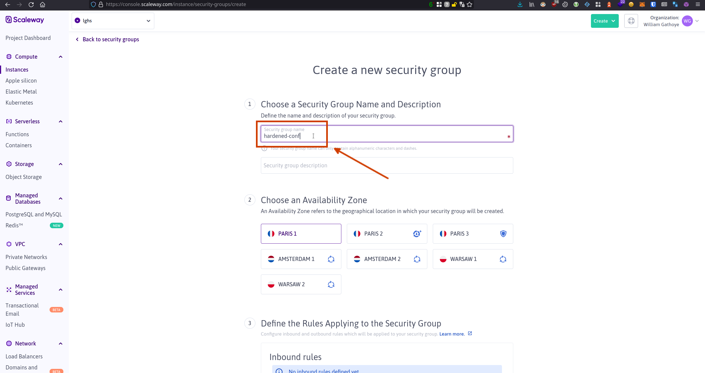
3. Sélectionnez `Paris 1` comme zone de disponibilité. Attentio, cette zone doit être la même que celle dans laquelle a été placée l'instance de machine que nous avons créée précédemment.
   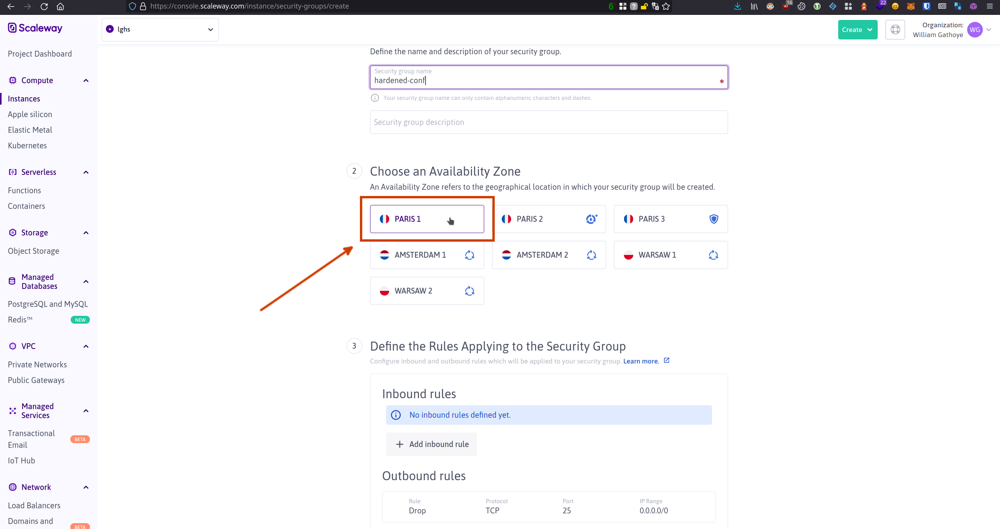
4. Défillez vers le bas pour atteindre le bas de la page, en passant la définition des règles (on les définira après) et cliquez sur le bouton `Create a new security group`.
   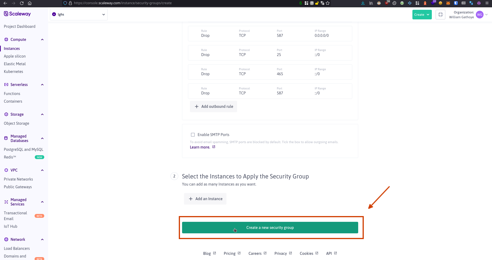
5. Retournez sur l'instance de machine, toujours via le lien `Instances` dans la barre latérale de gauche, onglet `Instances` et en cliquant sur l'instance `lghs-chat` :
   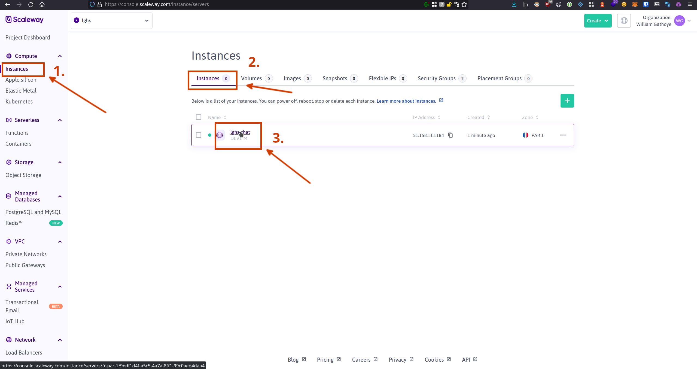
6. Faites défiler la page vers le bas pour atteindre les groupes de sécurité et cliquez sur l'icône en forme de crayon :
   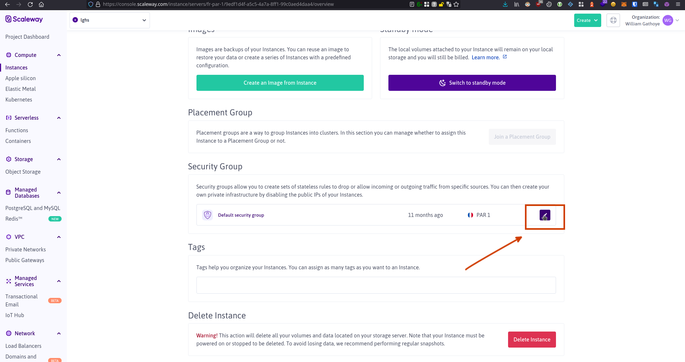
7. Dans le menu déroulant, changez le groupe de `Default security group` à `hardened-conf` (le groupe qu'on a défini précédemment) :
   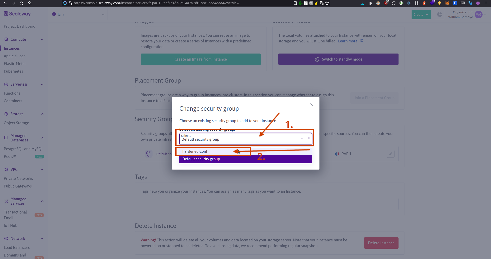
8. Cliquez que le bouton `Save` :
   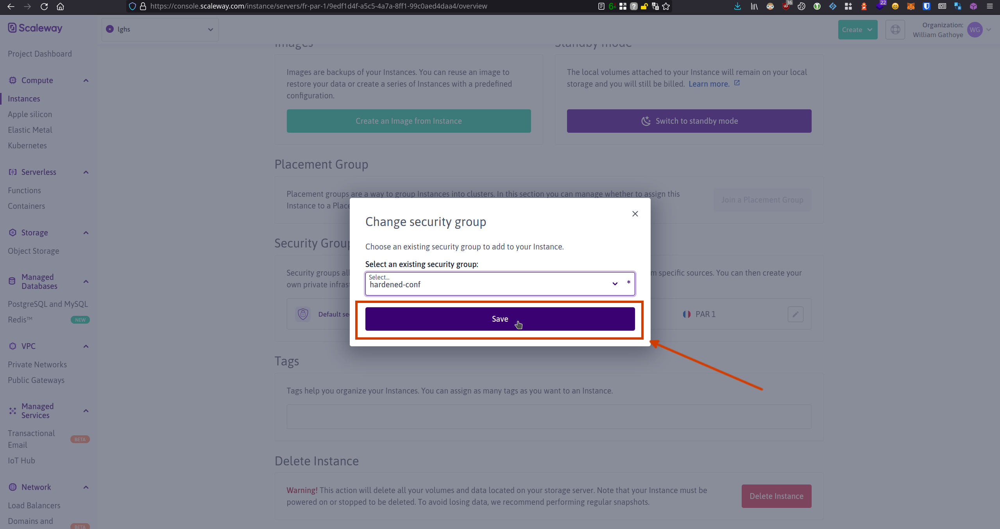
9. Constatez que le groupe de sécurité a changé pour notre machine :
   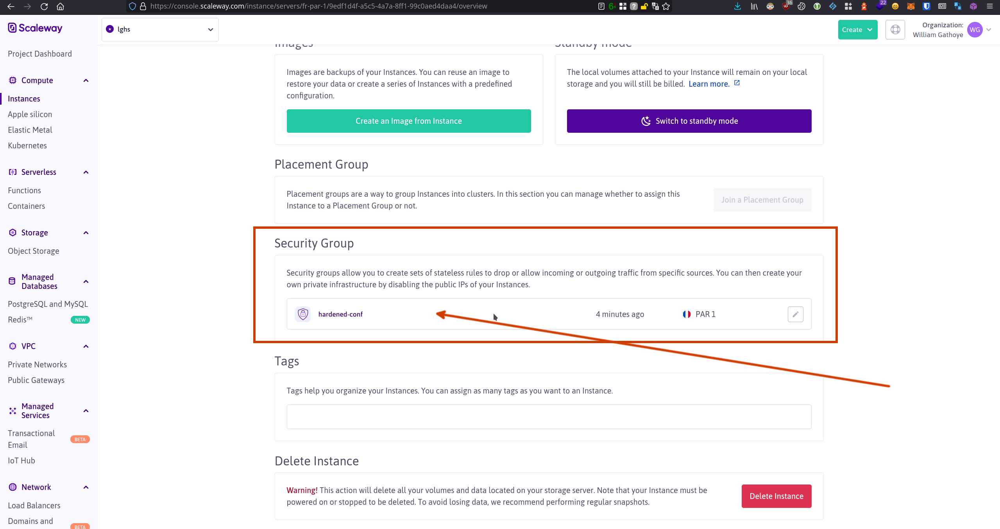
10. Retournez dans les groupes de sécurité en passant par le lien `Instances` de la barre latérale de gauche et en cliquant sur l'onglet `Security Groups` :
   
11. Sélectionnez le groupe de sécurité que vous venez de créer (`hardened-conf`) :
   
12. Allez dans l'onglet `Rules` :
   
13. Changez la politique par défaut pour le trafic entrant en cliquant sur le petit crayon :
   
14. Passez le paramètre `Inbound default policy` sur `Drop` :
   
15. Confirmez le changement en cliquant sur le bouton avec la flèche verte :
   
16. Passons maintenant aux règles à proprement parler, ce qui nous intéresse. Pour en définir, cliquez sur l'icône en forme de crayon dans la sections `Rules` (règles) :
   
17. Cliquez sur le bouton `Add inbound rule` :
   
18. Définissez la première règle comme suit ; pour continuer à en ajouter, cliquez de nouveau sur le bouton `Add inbound rule` et ainsi de suite :
   
19. Le but est d'obtenir la liste suivante. On autorise juste le traffic web (ports 80/443 à la fois en TCP et UDP - UDP pour tout ce qui est HTTP/2+/QUICK), le SSH (port 22) et l'ICMP. Notez que l'interface web de Scaleway ne prend en charge que l'ICMP et non l'ICMPv6 ce qui empèchera la machine de répondre aux requêtes ICMP en IPv6, cependant ça fonctionnerait en CLI via la commande `scw` (à tester) ([src.](https://feature-request.scaleway.com/posts/281/security-group-add-icmpv6-protocol)) :
   
20. Il faut autoriser les ports SMTP à soumettre des emails sinon Rocket.Chat ne sera pas autorisé à envoyer d'emails, ce qui posera problème (redéfinition de mot de passe et notifications par email notamment). Pour ce faire cochez la case `Enable SMTP Ports` :
   
21. Cocher la case a pour effet de vider la liste des règles prédéfinies de trafic sortant :
   
22. Faites défiler la page vers le haut et cliquez sur le bouton de crayon vert pour confirmer les changements.
   